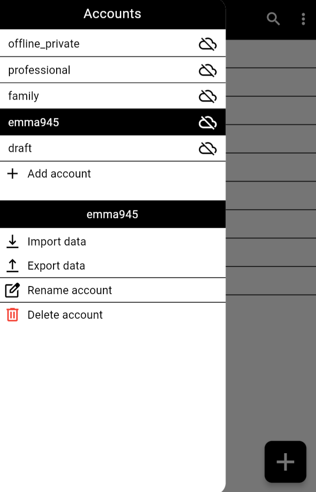
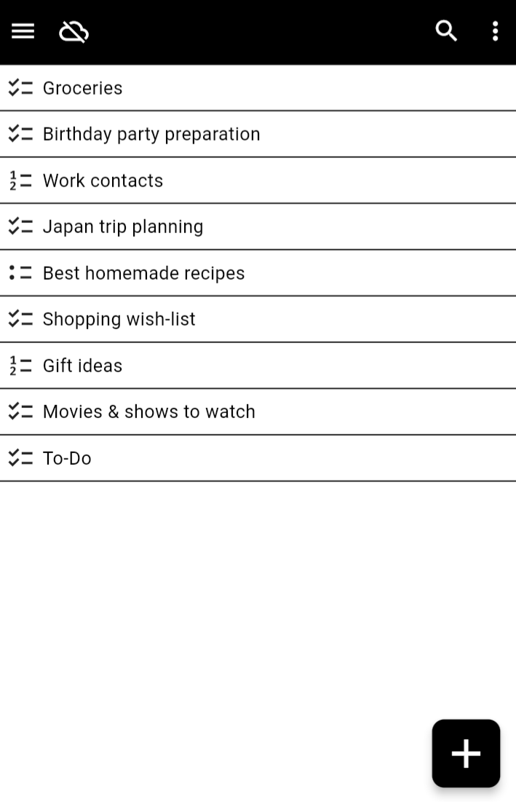
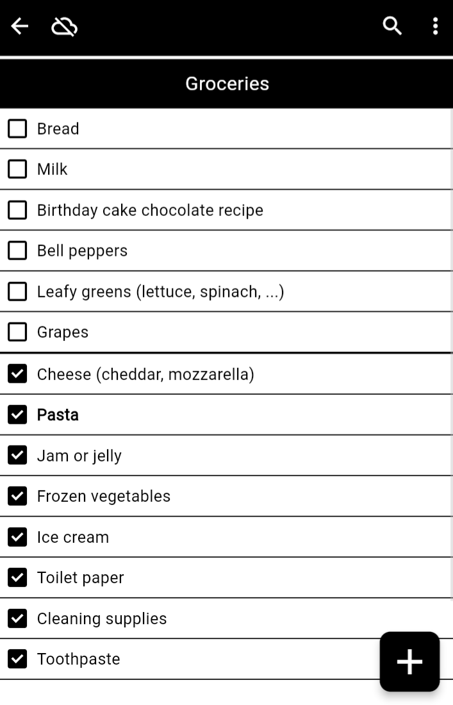
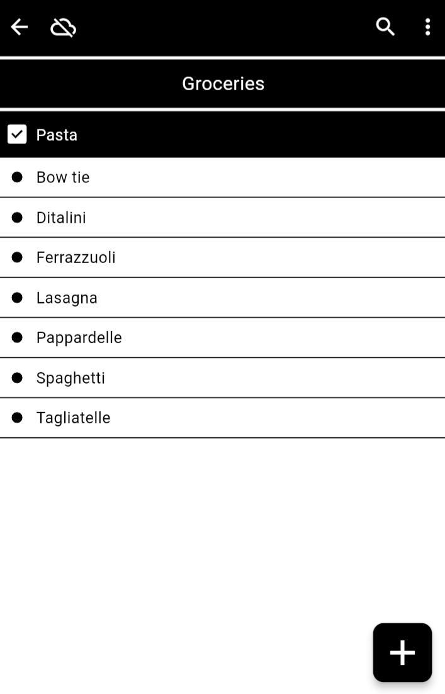

# Open-Items

**THIS PROJECT IS CURRENTLY UNDER DEVELOPMENT**

The flutter client for Open-Items.

A [free](https://en.wikipedia.org/wiki/Free_software) and [open-source](https://en.wikipedia.org/wiki/Open-source_software) ([FOSS](https://en.wikipedia.org/wiki/Free_and_open-source_software)), offline first, secure, [self-hostable](https://en.wikipedia.org/wiki/Self-hosting_(web_services)) and [cross-platform](https://en.wikipedia.org/wiki/Cross-platform_software) application for creating, managing, and sharing lists.

A **list** (or **collection**) is a grouping of **items**.
This application aims to be versatile and will handle various types of lists including checklists, ordered lists, and unordered lists.
Examples of lists can range from groceries to task lists, shopping lists, recipe ingredients, top-ten lists, and more.
Each item can also be a collection itself, enabling infinite collections nesting for improved organization and readability.

You can take a look at the [Project Specifications](./specifications.md) to learn more about the project.

### Screenshots

  
  
   
  
  

### Beta Test

You can beta test the application on the following platforms:

* WEB version (with [PWA](https://en.wikipedia.org/wiki/Progressive_web_app) available): **<https://test.open-items.org>**
* Android application, packaged with [APK](https://en.wikipedia.org/wiki/Apk_(file_format)) (download and install): **download [Android App](https://github.com/gruvw/open_items/releases/download/pre-alpha/Open-Items.apk)** 

**Note**: do not store valuable data, use the application exclusively for testing purposes.

If you encounter any bugs, please [open an issue](https://github.com/gruvw/open_items/issues/new) on the GitHub repository (thank you!).
Before reporting a new issue, check the [existing bugs](https://github.com/gruvw/open_items/issues?q=label%3Abeta-test) and the list of missing features bellow.  
Alternatively, you can send me an email at gruvw.dev@gmail.com to share any feedback on the application.

Certain features within the application are visible in the user interface, yet they have not been fully implemented (these should not be regarded as bugs):

* Online accounts (therefore simply create an offline "account")
* Search
* Export/Import
* Custom Reordering
